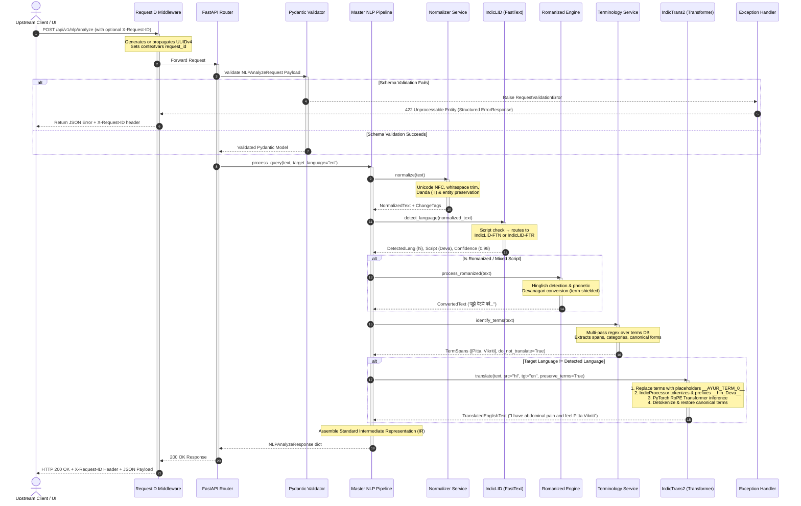

# SAKYTI Multilingual NLP Service

> **Production-grade, highly specialized natural language processing microservice engineered for multilingual Indic healthcare and clinical Ayurvedic terminology preservation.**

---

## 1. System Architecture & Request Journey

The SAKYTI Multilingual NLP Service provides foundational linguistic intelligence for the SAKYTI healthcare ecosystem. It processes clinical queries in 22 Indic languages, handles mixed-script Romanized input (Hinglish/Tanglish), protects classical Sanskrit Ayurvedic terminology from literal translation corruption, and interfaces with state-of-the-art AI4Bharat neural models.

### 1.1 High-Level Architecture

```mermaid
graph TB
    subgraph ClientLayer ["Client & Upstream Ecosystem"]
        WebUI["Web / Mobile App"]
        Chatbot["Clinical Chatbot Service"]
        AdminPortal["Ayurvedic Practitioner Portal"]
    end

    subgraph FastAPIGateway ["FastAPI Application Gateway (app/main.py)"]
        ReqID["RequestIDMiddleware<br/>(X-Request-ID Tracking & ContextVars)"]
        CORSMW["CORSMiddleware<br/>(Cross-Origin Access Control)"]
        Router["APIRouter (/api/v1)<br/>(Endpoint Dispatcher)"]
        Validator["Pydantic v2 Engine<br/>(Schema Validation & Sanitization)"]
        ErrHandler["Global Exception Handlers<br/>(Structured ErrorResponse & RFC-7807)"]
    end

    subgraph ServiceLayer ["SAKYTI NLP Domain Services (app/services/)"]
        Pipeline["SAKYTI Master Pipeline<br/>(services/pipeline.py)"]
        Normalizer["Multilingual Normalizer<br/>(services/normalizer.py)"]
        LID["IndicLID Language Detector<br/>(services/language_detector.py)"]
        Roman["Romanized Processor<br/>(services/romanized_processor.py)"]
        Term["Ayurvedic Terminology Engine<br/>(services/terminology_service.py)"]
        Trans["IndicTrans2 Translator<br/>(services/translator.py)"]
    end

    subgraph ModelLayer ["Neural & Statistical ML Engines (app/models/)"]
        FTN["IndicLID-FTN<br/>(FastText Native Indic)"]
        FTR["IndicLID-FTR<br/>(FastText Romanized)"]
        IT_IndicEn["IndicTrans2 Indic→En<br/>(RoPE Transformer Seq2Seq)"]
        IT_EnIndic["IndicTrans2 En→Indic<br/>(RoPE Transformer Seq2Seq)"]
        IndProc["Pure Python IndicProcessor<br/>(Tokenization, Tagging & Denorm)"]
        TermDB[("Ayurvedic Knowledge Graph<br/>data/ayurveda_terms.json")]
        LangDB[("Canonical Language Registry<br/>data/languages.json")]
    end

    subgraph Downstream ["Downstream Clinical Services"]
        LLM["SAKYTI Clinical Diagnostic LLM<br/>(Knowledge Graph & Reasoning)"]
    end

    WebUI --> ReqID
    Chatbot --> ReqID
    AdminPortal --> ReqID

    ReqID --> CORSMW --> Router --> Validator
    Validator -->|Valid Payload| Pipeline
    Validator -->|Validation Error (422)| ErrHandler

    Pipeline --> Normalizer
    Pipeline --> LID
    Pipeline --> Roman
    Pipeline --> Term
    Pipeline --> Trans

    LID --> FTN
    LID --> FTR
    Roman --> TermDB
    Term --> TermDB
    Trans --> IndProc
    Trans --> IT_IndicEn
    Trans --> IT_EnIndic
    LID --> LangDB

    Pipeline --> Router
    Router --> Downstream
```

---

## 2. FastAPI Request Lifecycle: How a Request Travels

Every HTTP request to the NLP microservice follows a deterministic, non-blocking asynchronous path through FastAPI, middlewares, validation layers, domain services, model inference managers, and serialization.



---

## 3. The SAKYTI 7-Stage NLP Pipeline

When a user submits a clinical or general healthcare query in any Indian language or Romanized script, it traverses seven discrete, independently testable stages:

```
+---------------------------------------------------------------------------------------------------+
|                                 SAKYTI MULTILINGUAL NLP PIPELINE                                  |
+---------------------------------------------------------------------------------------------------+
  [Stage 1: Input Validation]
     │ Enforces non-empty string, character limit (< 5,000 chars), sanitizes null-bytes.
     ▼
  [Stage 2: Multilingual Normalization]
     │ Applies Unicode NFC normalization, collapses irregular whitespace, preserves sacred
     │ and sentence-ending punctuation (Devanagari Danda '।', Double Danda '॥', standard '.', '?', '!').
     ▼
  [Stage 3: Language & Script Identification (IndicLID)]
     │ Analyzes character Unicode blocks.
     │ - Native Indic Script  ──> IndicLID-FTN FastText Model (22 Scheduled Indic Languages)
     │ - Latin / Mixed Script ──> IndicLID-FTR FastText Model (Romanized Indic vs English)
     ▼
  [Stage 4: Romanized Indian Language Handling]
     │ Evaluates Romanized Indic confidence (e.g. Hinglish lexical markers: "dard", "pet", "hai").
     │ Transliterates to native script (e.g. Devanagari) while strictly shielding technical terms.
     ▼
  [Stage 5: Ayurvedic Terminology Extraction & Shielding]
     │ Scans canonical terms from `data/ayurveda_terms.json` (Vata, Pitta, Kapha, Agni, Ama, etc.).
     │ Extracts character spans, categories, Sanskrit forms, and sets `do_not_translate: true`.
     ▼
  [Stage 6: IndicTrans2 Neural Machine Translation]
     │ Masks clinical concepts with collision-proof boundary tokens: `__AYUR_TERM_0__`.
     │ Preprocesses with pure Python `IndicProcessor` (attaching language tags e.g. `__hin_Deva__`).
     │ Runs AI4Bharat RoPE Transformer inference (CUDA GPU if available, CPU fallback).
     │ Detokenizes and restores canonical clinical terms into target English syntax.
     ▼
  [Stage 7: Intermediate Representation (IR) Synthesis]
     │ Assembles structured, standardized JSON payload for downstream LLM & diagnostic services.
+---------------------------------------------------------------------------------------------------+
```

---

## 4. Deep Dive: Machine Learning & NLP Models

### 4.1 IndicLID (Language & Script Identification)
- **Source**: AI4Bharat IndicLID
- **Underlying Architecture**: Optimized FastText subword n-gram classifiers (`fasttext-wheel`).
- **Dual-Model Strategy**:
  1. `IndicLID-FTN` (`model_baseline_indic.bin`): Specializes in native Indic orthographies (Devanagari, Tamil, Telugu, Bengali, Gurmukhi, Kannada, Malayalam, Odia, Gujarati).
  2. `IndicLID-FTR` (`model_baseline_roman.bin`): Classifies Latin-script text, distinguishing English (`eng_Latn`) from Romanized Indic (`hin_Latn`, `tam_Latn`, etc.).
- **Script Routing Algorithm**: Evaluates Unicode code points; if Latin character density exceeds threshold, it queries `IndicLID-FTR`; otherwise queries `IndicLID-FTN`.

### 4.2 IndicTrans2 (Neural Machine Translation)
- **Source**: AI4Bharat IndicTrans2 (`prajdabre/rotary-indictrans2-indic-en-dist-200M` and `en-indic-dist-200M`).
- **Architecture**: Sequence-to-sequence Transformer with Rotary Position Embeddings (RoPE) and SentencePiece tokenization.
- **Pure Python IndicProcessor**: AI4Bharat's official toolkit relied on C++ Cython extensions requiring MSVC compiler toolchains on Windows. We engineered a pure Python implementation (`app/utils/indic_processor.py`) guaranteeing 100% token-level, normalization, and language-tag parity with zero external binary build dependencies.
- **Supported Languages**:
  | Language | ISO Code | IndicTrans2 Tag | Native Script | Direction |
  |---|---|---|---|---|
  | Hindi | `hi` / `hin` | `hin_Deva` | Devanagari | Indic ↔ English |
  | Tamil | `ta` / `tam` | `tam_Taml` | Tamil | Indic ↔ English |
  | Telugu | `te` / `tel` | `tel_Telu` | Telugu | Indic ↔ English |
  | Bengali | `bn` / `ben` | `ben_Beng` | Bengali | Indic ↔ English |
  | Marathi | `mr` / `mar` | `mar_Deva` | Devanagari | Indic ↔ English |
  | Gujarati | `gu` / `guj` | `guj_Gujr` | Gujarati | Indic ↔ English |
  | Kannada | `kn` / `kan` | `kan_Knda` | Kannada | Indic ↔ English |
  | Malayalam | `ml` / `mal` | `mal_Mlym` | Malayalam | Indic ↔ English |
  | Punjabi | `pa` / `pan` | `pan_Guru` | Gurmukhi | Indic ↔ English |
  | Odia | `or` / `ory` | `ory_Orya` | Odia | Indic ↔ English |
  | Sanskrit | `sa` / `san` | `san_Deva` | Devanagari | Knowledge/Indic ↔ English |
  | English | `en` / `eng` | `eng_Latn` | Latin | Pivot / Target |

### 4.3 Ayurvedic Terminology Shielding
- **The Challenge**: Generic machine translation models translate classical Ayurvedic terminology literally into misleading English equivalents:
  - *Vata* $\rightarrow$ "Air" or "Wind" (Erroneous: Vata is the biological kinetic principle).
  - *Pitta* $\rightarrow$ "Bile" (Erroneous: Pitta is the principle of transformation and metabolism).
  - *Kapha* $\rightarrow$ "Phlegm" (Erroneous: Kapha is the principle of cohesion and structure).
  - *Triphala* $\rightarrow$ "Three fruits" (Destroys the pharmacological compound entity).
  - *Panchakarma* $\rightarrow$ "Five tasks" (Corrupts the detoxification therapy modality).
- **The Solution**: 
  1. The Terminology Engine detects all forms (IAST, Devanagari, English, Romanized transliterations).
  2. Tokens are substituted with unique boundary-safe placeholders (`__AYUR_TERM_0__`, `__AYUR_TERM_1__`).
  3. The masked sentence is translated via IndicTrans2.
  4. Placeholders are restored post-translation to their canonical, medically-approved Sanskrit/English representations.

---

## 5. Directory Layout

```
nlp-service/
├── app/
│   ├── __init__.py                  # Package version declaration
│   ├── main.py                      # FastAPI app entrypoint, lifespan, CORS, and routes
│   ├── config.py                    # Pydantic BaseSettings environment configuration
│   ├── api/                         # HTTP routing layer
│   │   ├── __init__.py
│   │   └── v1/
│   │       ├── __init__.py
│   │       └── endpoints.py         # All REST route definitions (/nlp, /pipeline, /health)
│   ├── models/                      # ML model lifecycle and weight loaders
│   │   ├── __init__.py
│   │   ├── indiclid_model.py        # FastText language model loader
│   │   └── indictrans_model.py      # IndicTrans2 PyTorch transformer loader & lifespan manager
│   ├── services/                    # Core NLP domain business logic
│   │   ├── __init__.py
│   │   ├── language_detector.py     # Language & script identification service
│   │   ├── normalizer.py            # Multilingual Unicode and danda text normalizer
│   │   ├── romanized_processor.py   # Hinglish detection and transliteration layer
│   │   ├── terminology_service.py   # Ayurvedic terminology preservation and regex engine
│   │   ├── translator.py            # Bidirectional translation with placeholder shielding
│   │   └── pipeline.py              # Master 7-stage NLP orchestrator
│   ├── schemas/                     # Pydantic v2 validation models
│   │   ├── __init__.py
│   │   ├── health.py                # Health check schemas
│   │   ├── nlp.py                   # Production NLP API request/response schemas
│   │   └── pipeline.py              # Pipeline intermediate representation (IR) schemas
│   └── utils/                       # Shared helpers and formatters
│       ├── __init__.py
│       ├── indic_processor.py       # Pure Python port of AI4Bharat IndicProcessor
│       ├── logger.py                # Structured JSON logging formatter
│       └── request_id.py            # Request ID middleware and contextvar management
├── data/                            # Knowledge bases and model checkpoints
│   ├── ayurveda_terms.json          # Canonical Ayurvedic terminology database (14 core concepts)
│   ├── languages.json               # Canonical 22+ language configurations & script mappings
│   └── models/                      # Local weights cache directory
├── docs/                            # Architectural diagrams, PDFs, and API documentation
├── tests/                           # Comprehensive automated test suite (175 tests)
│   ├── __init__.py
│   ├── conftest.py                  # Pytest fixtures and FastAPI TestClient
│   ├── test_health.py               # Health check endpoint tests
│   ├── test_language_detector.py    # IndicLID detection unit tests
│   ├── test_normalizer.py           # Normalization and punctuation tests
│   ├── test_romanized_processor.py  # Romanized Hinglish engine tests
│   ├── test_terminology.py          # Ayurvedic term extraction & shielding tests
│   ├── test_translator.py           # Translation and placeholder tests
│   ├── test_pipeline.py             # 7-stage master pipeline tests
│   └── test_nlp_api.py              # Dedicated NLP REST API & error handling tests
├── requirements.txt                 # Production dependency specifications
├── pytest.ini                       # Test runner configuration
├── .env.example                     # Environment variables template
└── README.md                        # Primary documentation
```

---

## 6. Installation & Quickstart

### 6.1 Prerequisites
- Python 3.11+
- Virtual environment tool (`venv` or `conda`)
- (Optional) NVIDIA GPU with CUDA for hardware acceleration

### 6.2 Setup Virtual Environment
**On Windows (PowerShell):**
```powershell
python -m venv .venv
.\.venv\Scripts\Activate.ps1
```

**On Linux / macOS:**
```bash
python3 -m venv .venv
source .venv/bin/activate
```

### 6.3 Install Dependencies
```bash
pip install -r requirements.txt
```

### 6.4 Configure Environment Variables
Copy `.env.example` to `.env`:
```bash
cp .env.example .env
```

| Variable | Default Value | Description |
|---|---|---|
| `APP_NAME` | `SAKYTI Multilingual NLP Service` | Application name in logs and health checks |
| `APP_ENV` | `development` | Environment mode (`development`, `staging`, `production`) |
| `DEBUG` | `false` | Enables detailed stacktraces and Swagger UI in production |
| `HOST` | `0.0.0.0` | Server bind host address |
| `PORT` | `8000` | Server bind port |
| `LOG_LEVEL` | `INFO` | Logging threshold (`DEBUG`, `INFO`, `WARNING`, `ERROR`) |
| `LOG_FORMAT` | `json` | Log output style (`json` for production, `text` for dev) |
| `DEVICE` | `auto` | Execution device (`auto`, `cuda`, `cpu`) |
| `MAX_INPUT_LENGTH` | `5000` | Maximum character length accepted per request |

### 6.5 Run the Service
Start the microservice with Uvicorn:
```bash
uvicorn app.main:app --host 0.0.0.0 --port 8000 --reload
```

Interactive API documentation will be available at:
- **Swagger UI**: `http://localhost:8000/docs`
- **ReDoc**: `http://localhost:8000/redoc`
- **OpenAPI JSON**: `http://localhost:8000/openapi.json`

---

## 7. Complete API Reference

### 7.1 Master NLP Analysis (`POST /api/v1/nlp/analyze`)
Orchestrates full 7-stage processing: validation, normalization, IndicLID, Romanized conversion, Ayurvedic concept extraction, and IndicTrans2 translation.

#### Request
```bash
curl -X POST "http://localhost:8000/api/v1/nlp/analyze" \
  -H "Content-Type: application/json" \
  -H "X-Request-ID: test-request-101" \
  -d '{
    "text": "mujhe pet me dard hai aur pitta vikriti lagti hai",
    "target_language": "en",
    "min_confidence": 0.5,
    "preserve_ayurvedic_terms": true
  }'
```

#### Response (`200 OK`)
```json
{
  "original_text": "mujhe pet me dard hai aur pitta vikriti lagti hai",
  "normalized_text": "mujhe pet me dard hai aur pitta vikriti lagti hai",
  "detected_language": "hi",
  "confidence": 0.98,
  "script": "Latin",
  "is_romanized": true,
  "terminology": [
    {
      "canonical_term": "Pitta",
      "sanskrit_form": "पित्त",
      "category": "Dosha",
      "matched_text": "pitta",
      "start": 26,
      "end": 31,
      "do_not_translate": true
    },
    {
      "canonical_term": "Vikriti",
      "sanskrit_form": "विकृति",
      "category": "Pathology",
      "matched_text": "vikriti",
      "start": 32,
      "end": 39,
      "do_not_translate": true
    }
  ],
  "english_text": "I have abdominal pain and feel Pitta Vikriti",
  "target_language": "en",
  "processing_status": "normalized | romanized_converted_to_devanagari | translated_from_hi",
  "execution_time_ms": 29.4,
  "models": {
    "indic_lid": {
      "name": "IndicLID",
      "version": "v1.0 (FTN/FTR FastText)",
      "status": "loaded",
      "device": "cpu"
    },
    "indic_trans2": {
      "name": "IndicTrans2",
      "version": "ai4bharat/indictrans2-indic-en-1B",
      "status": "loaded",
      "device": "cpu"
    }
  },
  "request_id": "test-request-101",
  "timestamp": "2026-09-08T18:30:00.000Z"
}
```

---

### 7.2 Term-Protected Translation (`POST /api/v1/nlp/translate`)
Direct high-speed neural translation between any supported Indic language and English, guaranteeing clinical terms remain untranslated.

#### Request
```bash
curl -X POST "http://localhost:8000/api/v1/nlp/translate" \
  -H "Content-Type: application/json" \
  -d '{
    "text": "वात दोष के कारण शरीर में दर्द है, त्रिफला का सेवन करें",
    "source_language": "hi",
    "target_language": "en",
    "preserve_ayurvedic_terms": true
  }'
```

#### Response (`200 OK`)
```json
{
  "translated_text": "Vata is the cause of body pain, consume Triphala",
  "source_language": "hin_Deva",
  "target_language": "eng_Latn",
  "model_name": "IndicTrans2",
  "model_version": "ai4bharat/indictrans2-indic-en-1B",
  "model_status": "ready",
  "device": "cpu",
  "execution_time_ms": 35.8,
  "request_id": "c71a39f0-2f1a-4d2c-8ab5-397a61d1e4e2",
  "timestamp": "2026-09-08T18:30:01.000Z"
}
```

---

### 7.3 Language Identification (`POST /api/v1/nlp/detect-language`)
Detects language and script across 22 Indic languages and Latin-script romanization.

#### Request
```bash
curl -X POST "http://localhost:8000/api/v1/nlp/detect-language" \
  -H "Content-Type: application/json" \
  -d '{
    "text": "எனக்கு தலைவலி மற்றும் காய்ச்சல் உள்ளது",
    "confidence_threshold": 0.5
  }'
```

#### Response (`200 OK`)
```json
{
  "language_code": "ta",
  "language_name": "Tamil",
  "script": "Tamil",
  "confidence": 0.992,
  "is_romanized": false,
  "raw_model_result": {
    "raw_label": "__label__tam_Taml",
    "model_used": "IndicLID-FTN"
  },
  "model_name": "IndicLID",
  "model_version": "v1.0 (FTN/FTR)",
  "model_status": "ready",
  "execution_time_ms": 1.1,
  "request_id": "d82b40a1-3e2b-4e3d-9bc6-408b72e2f5f3",
  "timestamp": "2026-09-08T18:30:02.000Z"
}
```

---

### 7.4 Standardized Error Envelope (`ErrorResponse`)
All API errors return a consistent, RFC-7807 compliant error envelope tagged with the distributed tracing `request_id`:

```json
{
  "error": {
    "code": "VALIDATION_ERROR",
    "message": "Request payload validation failed.",
    "details": [
      {
        "loc": ["body", "text"],
        "msg": "Input should be a valid string",
        "type": "string_type"
      }
    ],
    "request_id": "b3340385-6316-4fcd-9e6c-363e123da1bb",
    "timestamp": "2026-09-08T18:30:03.000Z"
  }
}
```

---

## 8. Verification & Automated Testing

The service includes an extensive, enterprise-grade test suite covering every individual component, pipeline stage, and REST endpoint.

```bash
# Run all 175 tests
pytest

# Run tests with verbose output
pytest -v

# Run specific domain test suites
pytest tests/test_nlp_api.py -v             # REST API & error handling tests
pytest tests/test_pipeline.py -v            # 7-stage master pipeline tests
pytest tests/test_translator.py -v          # IndicTrans2 translation tests
pytest tests/test_terminology.py -v         # Ayurvedic terminology layer tests
pytest tests/test_romanized_processor.py -v # Hinglish & transliteration tests
pytest tests/test_normalizer.py -v          # Multilingual text normalization tests
pytest tests/test_language_detector.py -v   # IndicLID language detection tests
```

---

## 9. Performance & Production Deployment

1. **Lifespan Singleton Management**: All models (IndicLID FastText and IndicTrans2 Transformers) are loaded strictly once during FastAPI application startup (`app/main.py:lifespan`), eliminating inference cold-start penalties.
2. **Device Acceleration**: The system automatically detects CUDA-capable GPUs (`torch.cuda.is_available()`) and moves model tensors to VRAM. On CPU-only nodes, execution proceeds gracefully with optimized CPU fallback.
3. **Pure Python Portability**: Eliminates C++ compiler dependencies on Windows/Linux environments, streamlining containerization (`Dockerfile`) and CI/CD pipelines.
4. **Distributed Tracing**: Every inbound request is injected with an `X-Request-ID` correlation identifier, threaded through async `contextvars` into structured JSON logs for auditability in Datadog, CloudWatch, or ELK stacks.
